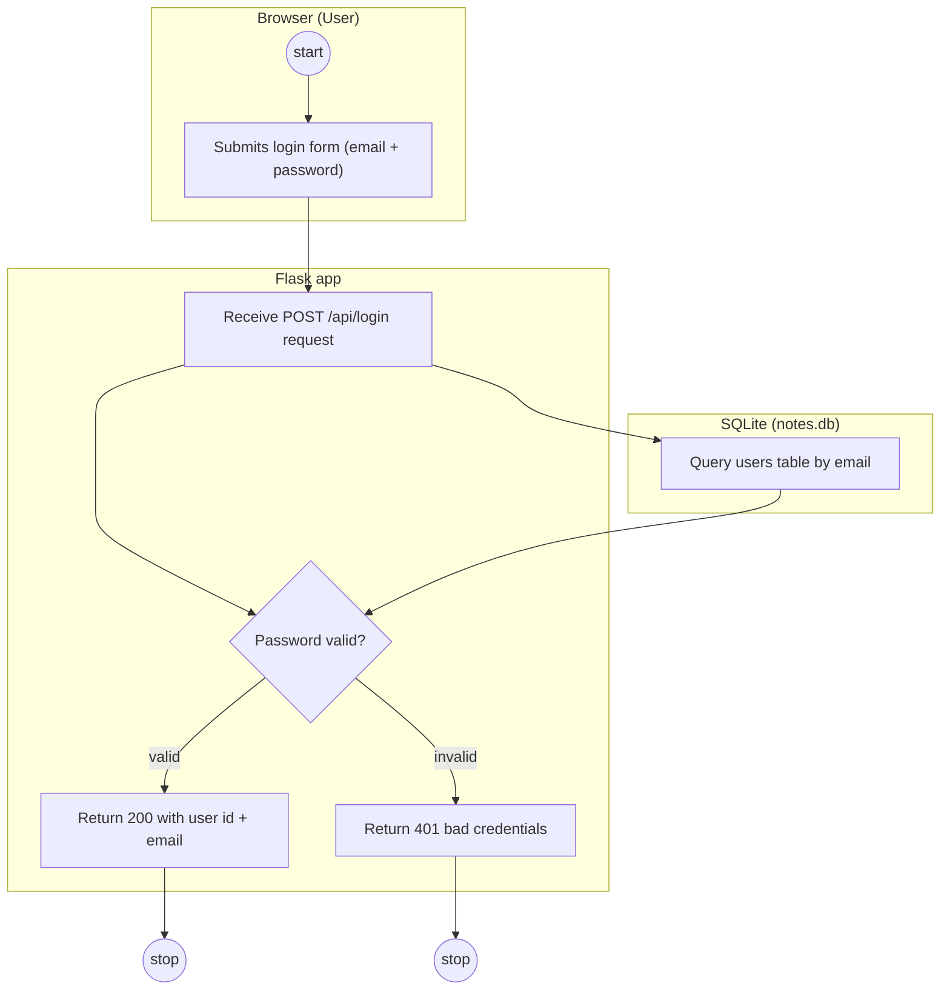
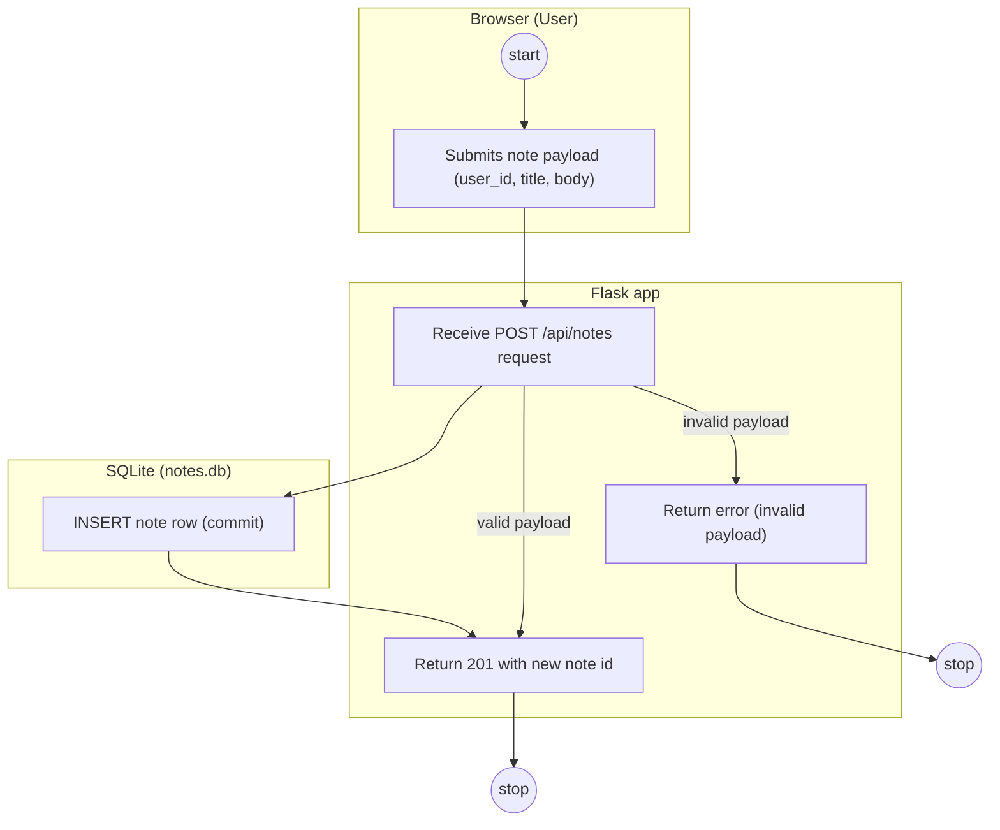

# Activity Diagram — Notes App

Behavioral UML model of the two user processes implemented by the Notes app, with
full-stack **Swimlane** partitions (Client / Server / Database), guarded
**Decision** diamonds, and explicit **Error** paths. Every node maps to a code
citation so the diagram can be verified line-by-line.

## Processes Modeled
* PR-1 — User Login (`POST /api/login`), `routes/auth.py:9-15`.
* PR-2 — Create Note (`POST /api/notes`), `routes/notes.py:9-15`.

## PR-1 — User Login (Swimlane View)

| Node | Meaning | Code Reference |
| :-- | :-- | :-- |
| a1 | start: user arrives at the login form | `routes/auth.py:9` |
| a2 | user submits email + password JSON | `routes/auth.py:11` |
| b1 | server receives `POST /api/login` | `routes/auth.py:9-10` |
| b2 | decision: does the password check pass? | `routes/auth.py:13` |
| b3 | success: `200` with user id + email | `routes/auth.py:15` |
| b4 | error: `401 bad credentials` | `routes/auth.py:14` |
| d1 | DB lookup `users` by email | `migrations/0001_init.sql:2-8` |
| e1 | end: process complete (success) | `routes/auth.py:15` |
| e2 | end: process complete (error) | `routes/auth.py:14` |

Flow evidence: the handler parses the JSON body (`routes/auth.py:11`), looks up the
user by email (`routes/auth.py:12`), and the decision `b2` is the guard
`if not user or not user.check_password(...)` (`routes/auth.py:13`); the password
check itself is `models.py:19-20` (hashed comparison via `models.py:4`).

## PR-2 — Create Note (Swimlane View)

| Node | Meaning | Code Reference |
| :-- | :-- | :-- |
| a1 | start: user opens the note form | `routes/notes.py:9` |
| a2 | user submits user_id, title, body JSON | `routes/notes.py:11` |
| b1 | server receives `POST /api/notes` | `routes/notes.py:9-10` |
| b3 | success: `201` with new note id | `routes/notes.py:15` |
| b4 | error: invalid payload (KeyError propagates) | `routes/notes.py:12` |
| d1 | INSERT into `notes`, then commit | `migrations/0001_init.sql:10-16` |
| e1 | end: process complete (success) | `routes/notes.py:15` |
| e2 | end: process complete (error) | `routes/notes.py:12` |

Flow evidence: the handler builds a `Note` ORM object from the payload
(`routes/notes.py:12`), stages it in the session (`routes/notes.py:13`) and commits
(`routes/notes.py:14`), which is the INSERT + commit in `d1` against the `notes`
table schema (`migrations/0001_init.sql:10-16`).

## Swimlanes (Partitions)
* **Client / Frontend:** the browser. UNVERIFIED: no frontend sources exist in this
  repository (`app.py:1`); the Client lane models the external caller of the API.
* **Server / Backend:** Flask app — `app.py:7`, blueprints registered at
  `app.py:13-14`, SQLAlchemy session at `db.py:4`.
* **Database:** SQLite via `SQLALCHEMY_DATABASE_URI` (`app.py:8-9`), schema at
  `migrations/0001_init.sql:1-16`.

## Decision Nodes & Guard Conditions
* PR-1 `b2` "Password valid?" — guards: `|valid|` (user exists AND hash check
  passes, `routes/auth.py:13`) and `|invalid|` (either branch of the `or`,
  `routes/auth.py:13-14`).
* PR-2 has no diamond in the code; `b1 -> b3|b4` models the implicit payload
  validity split at `data["user_id"]` / `data["title"]` (`routes/notes.py:12`) —
  an explicit guard is UNVERIFIED (no validation layer present).

## Error Handling
* `401 bad credentials` on failed login — `routes/auth.py:14`.
* Invalid note payload: uncaught `KeyError` -> Flask `500` — `routes/notes.py:12`
  (no explicit 400 handler — UNVERIFIED).
* `404` on unknown note id is served by `get_or_404` on the GET endpoint —
  `routes/notes.py:20` (not modeled here: GET is out of scope for these two
  processes).

## Checklist (per template)
* Clear scope: one process per diagram. Defined start/end: `a1`/`e1`/`e2`.
* Swimlanes used: Client / Server / Database in both diagrams.
* Guard conditions on every decision outgoing edge.
* Error paths modeled (401 / invalid payload), not only the happy path.
