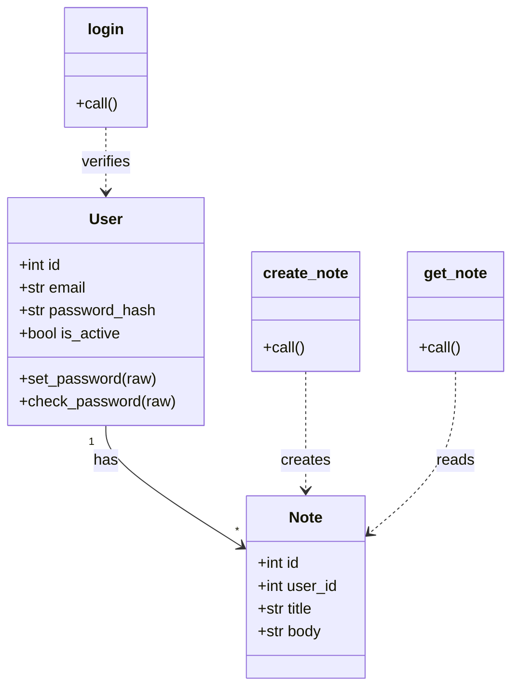

# Class Model — Notes App

## 1. Core Elements of a Class
Visibility: `+` public, `-` private, `#` protected, `~` package. Every element below is cited
to its declaration. Stereotypes per layer are given in the sections that follow.

## 2. Backend (Server-Side) Architecture

### A. Domain Models / Entities (ORM Layer)

| Class | Layer | Key Attributes | Key Methods | Code Reference |
| :-- | :-- | :-- | :-- | :-- |
| `User` | domain/ORM | `+ id: int`, `+ email: str`, `+ is_active: bool` | `+ set_password(raw)`, `+ check_password(raw): bool` | `models.py:7-20` |
| `Note` | domain/ORM | `+ id: int`, `+ user_id: int`, `+ title: str`, `+ body: str` | — | `models.py:23-29` |

### B. Data Access Objects / Repositories
* No dedicated repository layer; ORM query API used directly in controllers — UNVERIFIED: no
  repository classes exist in the codebase (`routes/auth.py:12`, `routes/notes.py:20`).

### C. Services (Business Logic Layer)
* No service layer; business logic lives in route handlers — UNVERIFIED: no `services` module
  exists (`routes/auth.py:10-15`).

### D. Controllers / Resolvers

| Class / Object | Layer | Responsibilities | Code Reference |
| :-- | :-- | :-- | :-- |
| `auth.bp` (Blueprint) | controller | `/api/login` auth endpoint | `routes/auth.py:6`, `routes/auth.py:9-15` |
| `notes.bp` (Blueprint) | controller | `/api/notes` CRUD endpoints | `routes/notes.py:6`, `routes/notes.py:9-21` |
| `db` (SQLAlchemy) | data-access | session + ORM engine | `db.py:3-4` |

## 3. Cross-Boundary Data (DTOs)
* Request payloads are plain JSON dicts parsed ad hoc (`request.get_json`) — UNVERIFIED: no
  DTO classes or pydantic schemas exist (`routes/auth.py:11`, `routes/notes.py:11`).
* Responses are ad hoc JSON via `jsonify` — `routes/auth.py:15`, `routes/notes.py:15`.

## 4. Frontend (Client-Side) Architecture
* No frontend present in this repository; the API is consumed by external clients —
  UNVERIFIED: no `templates/`, `static/`, or SPA sources found (`app.py:1`).

## 5. Class Diagram & Relationships

| Node | Element | Code Reference |
| :-- | :-- | :-- |
| User | User ORM entity | `models.py:7-20` |
| Note | Note ORM entity | `models.py:23-29` |
| login | POST /api/login handler | `routes/auth.py:9-15` |
| create_note | POST /api/notes handler | `routes/notes.py:9-15` |
| get_note | GET /api/notes/<id> handler | `routes/notes.py:18-21` |

Relationships:

| From | To | Type | Evidence | Code Reference |
| :-- | :-- | :-- | :-- | :-- |
| User | Note | association 1:N | ORM relationship + backref | `models.py:14` |
| login | User | dependency | calls `check_password` | `routes/auth.py:13` |
| create_note | Note | dependency | instantiates `Note` | `routes/notes.py:12` |
| get_note | Note | dependency | queries `Note` | `routes/notes.py:20` |
| User, Note | db | dependency | inherit `db.Model` | `models.py:3` |

## 6. Best Practices Observations
* **Separation of Concerns:** weak — controllers mix validation, lookup and persistence
  (`routes/auth.py:10-15`).
* **DTO vs Entity:** entities are queried directly; responses built by `jsonify` over model
  fields (`routes/notes.py:21`).
* **Interface over Implementation:** none — concrete classes only (`models.py:7`).

## Assumptions & Unverified Items
* No repository/service/DTO layers exist — UNVERIFIED by absence search (no matching modules).
* No frontend in this repo — UNVERIFIED.
