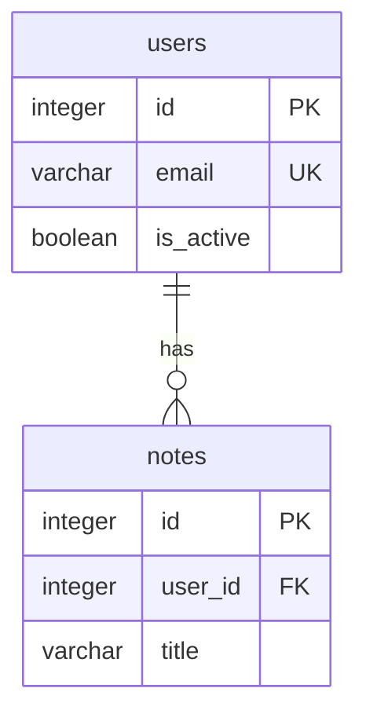

# Database Model — Notes App

## 1. Project & System Overview
**System Name:** Notes App. A SQLite-backed note store for authenticated users.
**Version:** 1.0. **Author:** Codebase Modeler (generated).
**Description:** Stores users and their notes; single relational store, file-backed. Citations: `migrations/0001_init.sql:2-16`, `db.py:3`.

## 2. Database Architecture & Technology Stack
* **Database Type:** Relational (SQLite) — `db.py:2-4`
* **DBMS:** SQLite, default URI `sqlite:///notes.db` — `app.py:8-9`
* **ORM:** Flask-SQLAlchemy — `requirements.txt:2`, `db.py:3`
* **Migration Tool:** hand-written SQL migrations — `migrations/0001_init.sql:1`

## 3. Global Naming Conventions & Standards
* **Tables:** snake_case plural (`users`, `notes`) — `migrations/0001_init.sql:2`, `migrations/0001_init.sql:10`
* **Columns:** snake_case — `migrations/0001_init.sql:4`
* **Primary Keys:** `id` INTEGER — `migrations/0001_init.sql:3`, `migrations/0001_init.sql:11`
* **Foreign Keys:** `<singular>_id` (`user_id`) — `migrations/0001_init.sql:12`
* **Timestamps:** `created_at` on both tables; no `updated_at` — `migrations/0001_init.sql:7`, `migrations/0001_init.sql:15`

## 4. Entity-Relationship Diagram

| Node | Element | Code Reference |
| :-- | :-- | :-- |
| users | users table | `migrations/0001_init.sql:2-8` |
| notes | notes table | `migrations/0001_init.sql:10-16` |

## 5. Core Entities (Data Dictionary)

### 5.1. Entity: `users`
**Description:** Authentication + profile data for application users — `models.py:7-8`.

| Column Name | Data Type | Constraints / Modifiers | Description | Code Reference |
| :-- | :-- | :-- | :-- | :-- |
| `id` | INTEGER | PRIMARY KEY | Unique user id | `migrations/0001_init.sql:3` |
| `email` | VARCHAR(255) | UNIQUE, NOT NULL | Login email | `migrations/0001_init.sql:4` |
| `password_hash` | VARCHAR(255) | NOT NULL | Hashed password | `migrations/0001_init.sql:5` |
| `is_active` | BOOLEAN | DEFAULT 1 | Active flag | `migrations/0001_init.sql:6` |
| `created_at` | TIMESTAMP | DEFAULT CURRENT_TIMESTAMP | Creation ts | `migrations/0001_init.sql:7` |

### 5.2. Entity: `notes`
**Description:** Notes owned by a user — `models.py:23-24`.

| Column Name | Data Type | Constraints / Modifiers | Description | Code Reference |
| :-- | :-- | :-- | :-- | :-- |
| `id` | INTEGER | PRIMARY KEY | Note id | `migrations/0001_init.sql:11` |
| `user_id` | INTEGER | FK users(id), NOT NULL | Note owner | `migrations/0001_init.sql:12` |
| `title` | VARCHAR(120) | NOT NULL | Note title | `migrations/0001_init.sql:13` |
| `body` | TEXT | NULL | Note body | `migrations/0001_init.sql:14` |
| `created_at` | TIMESTAMP | DEFAULT CURRENT_TIMESTAMP | Creation ts | `migrations/0001_init.sql:15` |

## 6. Relationships & Cardinality
* **Users to Notes (1:N):** one `users` row has many `notes` rows.
  * *Foreign Key:* `notes.user_id` -> `users.id` — `migrations/0001_init.sql:12`
  * *ORM mapping:* `db.relationship("Note", backref="author")` — `models.py:14`
  * *On Delete:* not declared (SQLite default: no action) — `migrations/0001_init.sql:12`

## 7. Indexing & Performance Strategy
* **Primary Key Indexes:** `users.id`, `notes.id` — `migrations/0001_init.sql:3`, `migrations/0001_init.sql:11`
* **Foreign Key Indexes:** `idx_notes_user` on `notes(user_id)` — `migrations/0001_init.sql:18`
* **Unique Indexes:** `users.email` UNIQUE constraint — `migrations/0001_init.sql:4`

## 8. Security & Data Compliance
* **Passwords:** stored as salted hashes via werkzeug security, never plaintext — `models.py:4`, `models.py:16-17`
* **PII:** `email` is personal data — `migrations/0001_init.sql:4`
* **Soft Deletes vs Hard Deletes:** no `deleted_at` column; hard deletes only — UNVERIFIED: absence confirmed against full DDL (`migrations/0001_init.sql:2-16`)

## 9. Seed Data & Environments
* **Development:** no seed files present; schema comes from the single migration — UNVERIFIED: no seeders found in repo (`migrations/0001_init.sql:1`)

## 10. Future Scalability Considerations
* **Engine swap:** SQLite is file-backed; a `DATABASE_URL` env override exists for moving to PostgreSQL — `app.py:8-9`
* **Growth hotspot:** `notes` is the only growing table; `user_id` already indexed — `migrations/0001_init.sql:18`
* UNVERIFIED: no sharding/replication strategy is declared anywhere in code.

## Assumptions & Unverified Items
* Soft deletes: absent — UNVERIFIED (no soft-delete column in DDL).
* Scalability plan: not declared in code — UNVERIFIED.
* Seed data: none found — UNVERIFIED.
