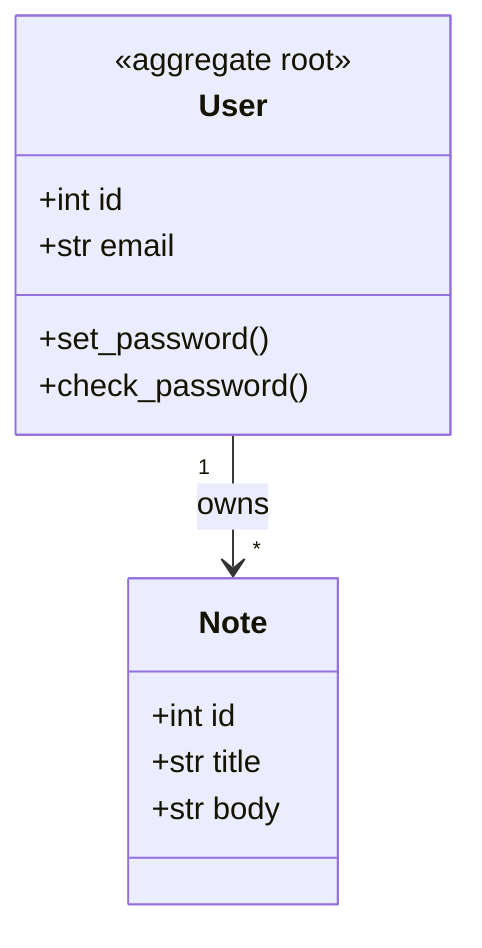

# Domain Model — Notes App

## 1. Introduction and Scope
* **System Name:** Notes App
* **Purpose:** let authenticated users store and read personal notes.
* **Scope:** included: user identity, password verification, note creation/reading.
  Excluded: note editing/deletion (not implemented) — UNVERIFIED: no such routes exist
  (`routes/notes.py:9-21`).

## 2. Ubiquitous Language (Glossary)
* **User:** an authenticated account identified by unique email — `models.py:7-11`.
* **Note:** a titled text document owned by exactly one user — `models.py:23-27`.
* **Author:** the owning user of a note (backref name) — `models.py:14`.
* **Active user:** a user with `is_active` true; the flag exists but login does not check it —
  `models.py:12`, `routes/auth.py:12-15` (UNVERIFIED: flag unused by login).

## 3. Bounded Contexts
* **Identity & Access:** registration of credentials and login verification — `routes/auth.py:1`,
  `models.py:7-20`.
* **Notes:** creation and retrieval of notes — `routes/notes.py:1`, `models.py:23-29`.
* The app is small; these two contexts communicate only through the `User` aggregate.

## 4. Core Domain Elements

### 4.1. Entities
* **Entity: `User`** — identity: integer `id` (`models.py:9`); attributes: `email`,
  `password_hash`, `is_active`, `created_at` (`models.py:10-13`); behaviors:
  `set_password()` (`models.py:16-17`), `check_password()` (`models.py:19-20`).
* **Entity: `Note`** — identity: integer `id` (`models.py:25`); attributes: `user_id`,
  `title`, `body`, `created_at` (`models.py:26-29`); behaviors: none defined
  (UNVERIFIED: passive data holder — `models.py:23-29`).

### 4.2. Value Objects
* None. Address/Money-style immutable carriers are absent — UNVERIFIED: no value-object
  types exist in the codebase (`models.py:1`).

### 4.3. Aggregates and Aggregate Roots
* **Aggregate Root: `User`** — children: `Note` collection (lazy dynamic relationship) —
  `models.py:14`. External code must reference `User` to reach its notes
  (`models.py:14`).

## 5. Domain Relationships
* **User to Note (1:N):** one user owns many notes — `models.py:14`, `migrations/0001_init.sql:12`.

## 6. Business Rules & Invariants
1. **Email is unique per user** — enforced by DB UNIQUE constraint — `migrations/0001_init.sql:4`.
2. **Login requires a known email AND a matching password hash** — enforced in handler —
   `routes/auth.py:12-14`.
3. **Every note must have a non-empty title and an owner** — NOT NULL + FK —
   `migrations/0001_init.sql:12-13`.
4. **Passwords are never stored in plaintext** — hashed on set, compared on check —
   `models.py:16-17`, `models.py:19-20`.

## 7. Domain Events
* None. No event emitters, signals, or message producers exist — UNVERIFIED: no `emit`/
  `publish`/signal code found (`routes/notes.py:13-14` show plain commits).

## 8. Domain Services
* None. Cross-entity operations (login, note creation) live in route handlers —
  UNVERIFIED: no service classes (`routes/auth.py:10`, `routes/notes.py:10`).

## Domain Diagram

| Node | Element | Code Reference |
| :-- | :-- | :-- |
| User | aggregate root User | `models.py:7-20` |
| Note | owned entity Note | `models.py:23-29` |

## Assumptions & Unverified Items
* No value objects, domain events, or domain services — UNVERIFIED by absence.
* `is_active` is declared but not enforced at login — UNVERIFIED (see §2).
