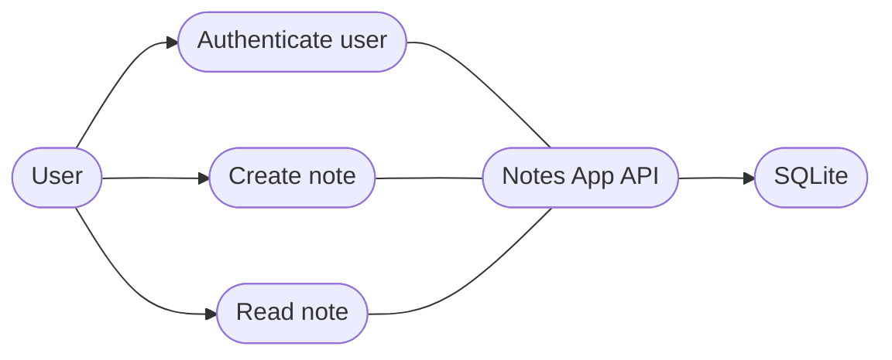

# Use-Case Model — Notes App

## 1. Introduction
### 1.1 Purpose
Capture the functional requirements of the Notes App and how users interact with it.
The system is a REST API (`app.py:13-14`).

### 1.2 Scope
In scope: login, note creation, note reading. Out of scope: registration, note editing,
note deletion — UNVERIFIED: no corresponding routes exist (`routes/auth.py:9`,
`routes/notes.py:9`, `routes/notes.py:18`).

### 1.3 Definitions, Acronyms, and Abbreviations
* **User / Note / Author:** see Domain Model §2 (`models.py:7-14`).
* **Blueprint:** a Flask route group (`routes/auth.py:6`).

## 2. System Boundary & Actors

### 2.1 Primary Actors
* **User:** any client holding valid credentials; the only human actor — `routes/auth.py:10-15`.

### 2.2 Secondary / System Actors
* **SQLite database:** persists users and notes — `app.py:8-9`, `db.py:3`.
* **werkzeug security library:** password hashing/verification — `models.py:4`.

## 3. Use-Case Diagram

| Node | Element | Code Reference |
| :-- | :-- | :-- |
| actor1 | primary actor User | `routes/auth.py:10` |
| sys1 | system boundary (Flask app) | `app.py:7-14` |
| uc1 | UC-01 Authenticate user | `routes/auth.py:9-15` |
| uc2 | UC-02 Create note | `routes/notes.py:9-15` |
| uc3 | UC-03 Read note | `routes/notes.py:18-21` |
| dbx | SQLite database | `app.py:8-9` |

**Diagram Description:** the User actor interacts with three use cases exposed by the API;
all of them read from or write to SQLite. No authentication guard is applied to the note
routes — UNVERIFIED: note endpoints accept an unverified `user_id` (`routes/notes.py:11-12`).

## 4. Use-Case Specifications

### UC-01: Authenticate a user

**1. Brief Description:** Verify a user's email/password pair against the store.

**2. Actors**
* **Primary:** User (`routes/auth.py:10`)
* **Secondary:** SQLite (`app.py:8-9`), werkzeug security (`models.py:4`)

**3. Pre-conditions**
* A user row exists with a stored password hash — `migrations/0001_init.sql:5`.
* The client sends a JSON body with `email` and `password` — `routes/auth.py:11`.

**4. Post-conditions**
* On success: an HTTP 200 response carrying the user id and email — `routes/auth.py:15`.
* On failure: an HTTP 401 `bad credentials` response; no state change — `routes/auth.py:13-14`.

**5. Main Success Scenario (Happy Path)**
1. **Actor:** sends `POST /api/login` with email + password. — `routes/auth.py:9`
2. **System (Backend):** parses the JSON body. — `routes/auth.py:11`
3. **System (Backend):** looks up the user by email. — `routes/auth.py:12`
4. **System (Backend):** verifies the password against the stored hash. — `routes/auth.py:13`, `models.py:19-20`
5. **System (Backend):** returns `200` with `id` and `email`. — `routes/auth.py:15`

**6. Alternative Flows (Extensions)**
* None — UNVERIFIED: no alternative paths (e.g. token refresh) exist in the code.

**7. Exceptions (Error Flows)**
* **5a. Unknown email or wrong password:** backend returns `401 bad credentials`.
  — `routes/auth.py:13-14`

**8. Special Requirements (NFRs)**
* Passwords compared via constant-time-safe werkzeug check — `models.py:20`.
* UNVERIFIED: no rate limiting or lockout declared in code.

### UC-02: Create a note

**1. Brief Description:** Store a new note owned by the given user.

**2. Actors**
* **Primary:** User (`routes/notes.py:10`)
* **Secondary:** SQLite (`app.py:8-9`)

**3. Pre-conditions**
* Client supplies JSON with `user_id` and `title` — `routes/notes.py:11-12`.
* UNVERIFIED: `user_id` is not checked against an authenticated session
  (`routes/notes.py:11-12`).

**4. Post-conditions**
* A `notes` row is committed with the given fields — `routes/notes.py:13-14`.
* HTTP 201 with the new note id — `routes/notes.py:15`.

**5. Main Success Scenario (Happy Path)**
1. **Actor:** sends `POST /api/notes` with `user_id`, `title`, optional `body`. — `routes/notes.py:9`
2. **System (Backend):** parses JSON and builds a `Note` instance. — `routes/notes.py:11-12`
3. **System (Backend):** adds and commits the note to the session. — `routes/notes.py:13-14`
4. **System (Backend):** returns `201` with the note id. — `routes/notes.py:15`

**6. Alternative Flows (Extensions)**
* **2a. Omitted body:** body defaults to empty string. — `routes/notes.py:12`

**7. Exceptions (Error Flows)**
* **2a. Missing `user_id` or `title`:** `KeyError`/IntegrityError surface as HTTP 500
  (no validation layer) — UNVERIFIED: no explicit error handling at
  `routes/notes.py:11-14`.

**8. Special Requirements (NFRs)**
* UNVERIFIED: no size limit or rate limit declared.

### UC-03: Read a note

**1. Brief Description:** Fetch one note by id.

**2. Actors**
* **Primary:** User (`routes/notes.py:19`)

**3. Pre-conditions**
* The note id exists — `routes/notes.py:20`.

**4. Post-conditions**
* HTTP 200 with id/title/body; 404 if missing — `routes/notes.py:20-21`.

**5. Main Success Scenario (Happy Path)**
1. **Actor:** sends `GET /api/notes/<id>`. — `routes/notes.py:18`
2. **System (Backend):** fetches the note or raises 404. — `routes/notes.py:20`
3. **System (Backend):** returns the note fields. — `routes/notes.py:21`

**6. Alternative Flows (Extensions)**
* None.

**7. Exceptions (Error Flows)**
* **2a. Note not found:** `get_or_404` raises HTTP 404. — `routes/notes.py:20`

**8. Special Requirements (NFRs)**
* UNVERIFIED: no ownership check — any caller can read any note (`routes/notes.py:20`).

## 5. Traceability Matrix

| Use Case ID | Use Case Name | Implementation (code) |
| :-- | :-- | :-- |
| UC-01 | Authenticate a user | `routes/auth.py:9-15` |
| UC-02 | Create a note | `routes/notes.py:9-15` |
| UC-03 | Read a note | `routes/notes.py:18-21` |

## 6. Appendix
* Full data dictionary: `DatabaseModel.md` §5.
* Behavioral flows: `ActivityDiagram.md` (PR-1 login, PR-2 create note).

## Assumptions & Unverified Items
* Note endpoints lack an auth guard — UNVERIFIED (see UC-02/UC-03 §7-8).
* No registration use case exists — UNVERIFIED.
