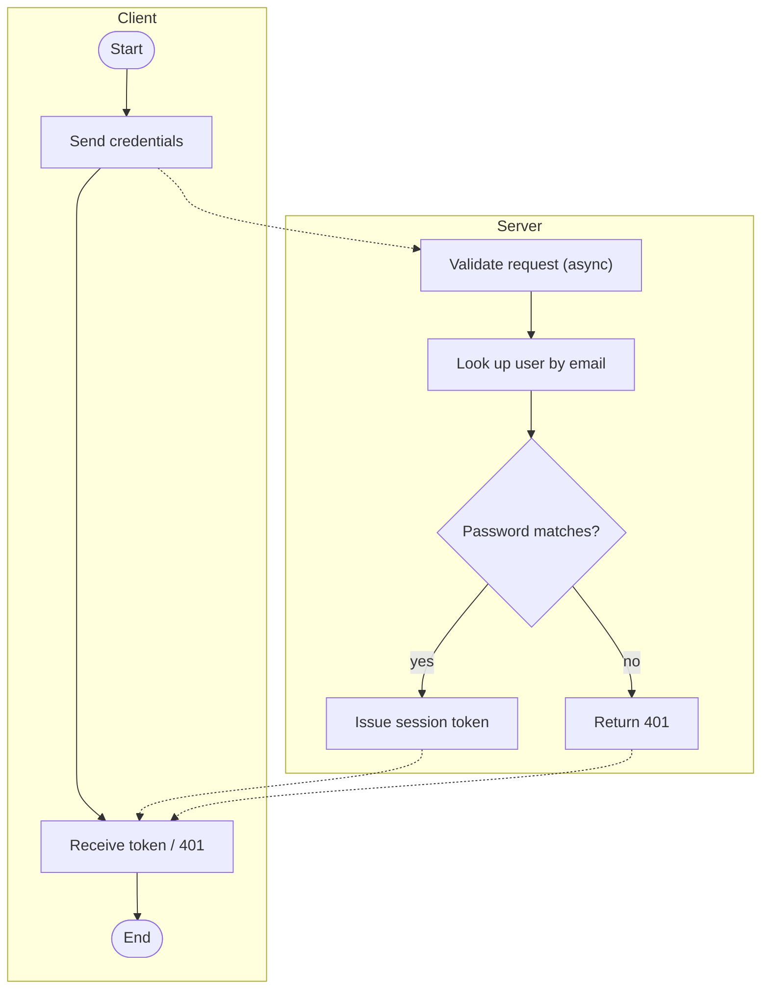
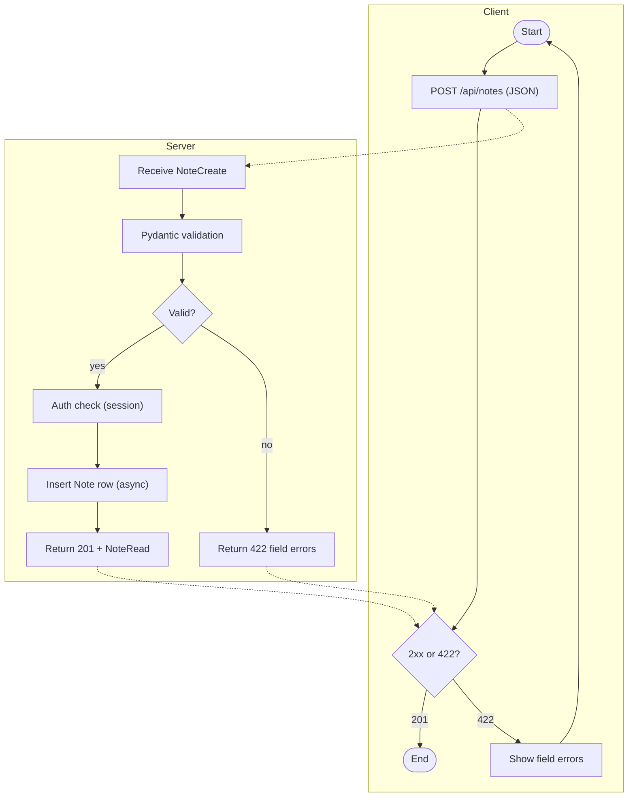

# Activity Diagram — notes-app (modernized)

> Source: tests/fixture-source (notes-app) — modernize-modeler output; every id below resolves to modernization-plan.json.
> Modernized per M-1 (async handlers), M-2 (async ORM), M-3 (PostgreSQL 16) and M-6 (uvicorn workers).

## Swimlanes

Two swimlanes per flow: **Client** and **Server**. The server lane now spans a pool of uvicorn
workers (M-6) in front of one PostgreSQL 16 instance (M-3) instead of the single debug process
from the source (`app.py:17-18`).

## Decision Points

| id | question | yes | no |
| :-- | :-- | :-- | :-- |
| s3 | password matches? | issue token | 401 (`routes/auth.py:9-15`) |
| b3 | Pydantic validation passes? | continue | 422 + field errors (M-4) |
| n3 | status 2xx? | finish | show errors / retry |

## Error Paths

- **401** — bad credentials at login (semantics unchanged, `routes/auth.py:9-15`).
- **422** — malformed note payload; declarative Pydantic errors replace the legacy unhandled
  KeyError → 500 (`routes/notes.py:9-15`, I-2, M-4).
- **404** — unknown note id (`routes/notes.py:18-21`).
- **5xx** — only for genuine server faults; the debug-reloader entrypoint no longer exists
  (M-6, `app.py:18`).

## PR-1 — Login flow

| node | meaning |
| :-- | :-- |
| c1 | client start |
| c2 | client sends credentials |
| c3 | client receives token or 401 |
| c4 | client end |
| s1 | server validates the request (async, M-1) |
| s2 | async lookup of the user by email (M-2) |
| s3 | password-match decision |
| s4 | issue the session token |
| s5 | 401 response |

## PR-2 — Create-note flow

| node | meaning |
| :-- | :-- |
| n1 | client start / retry loop |
| n2 | client sends the note payload |
| n3 | client branches on the status class |
| n4 | happy-path end |
| n5 | client renders field errors |
| b1 | server receives the request (M-1) |
| b2 | Pydantic v2 validation (M-4) |
| b3 | validation decision |
| b4 | session authentication check |
| b5 | async insert of the Note row (M-2) |
| b6 | 201 response with NoteRead |
| b7 | 422 response with field errors (I-2 closed) |

## Deployment Notes

Requests now arrive at a uvicorn worker pool (M-6); each worker runs async handlers (M-1)
against the shared PostgreSQL 16 database (M-3) through the async ORM (M-2). The legacy
single-process `app.run(debug=True)` entrypoint (`app.py:17-18`) is gone from the modernized
flow. The source's synchronous single-process note (`ActivityDiagram.md:109`) is closed by
M-1 + M-6; deeper concurrency modeling stays out of scope (A-6, deferred with a reason in the
plan).

## Modernization Decisions (this document)

| id | decision | effect on this document |
| :-- | :-- | :-- |
| M-1 | Flask → FastAPI | async lanes; declarative 422 |
| M-2 | async SQLAlchemy 2.x | async lookup/insert steps (s2, b5) |
| M-3 | PostgreSQL 16 | one shared database across workers |
| M-6 | uvicorn workers + Docker | multi-process server lane |
| A-6 | async/queue modeling deferred | worker model documented in Deployment Notes |

## Resolved Assumptions & Issues

| source marker | id | outcome |
| :-- | :-- | :-- |
| `ActivityDiagram.md:109` — synchronous, single-process request handling | A-6 | deferred with reason: M-1 + M-6 remove the single-process bottleneck; deep concurrency modeling stays out of scope |
