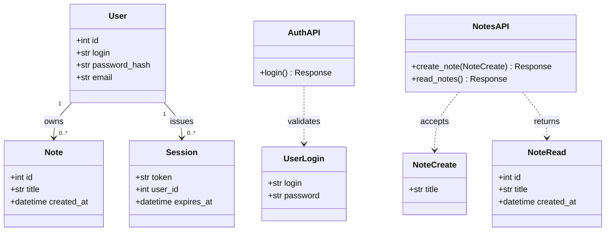

# Class Model — notes-app (modernized)

> Source: tests/fixture-source (notes-app) — produced by modernize-modeler against modernization-plan.json + intake.json.
> Class identities of the kept domain layer are cited to the repo; DTOs and API classes reflect the modernized stack.

## Core Elements

The core elements are the two domain entities (User, Note — **kept (K-1)**), the Session credential row, the FastAPI routers, and the Pydantic v2 schemas (M-4). The class diagram below maps the modernized object graph:

| Node | Meaning | Layer |
|---|---|---|
| User | domain entity, credential + identity | domain |
| Note | domain entity, one title per note | domain |
| Session | credential row / bearer token | security |
| AuthAPI | login endpoint (async handler) | api |
| NotesAPI | create/read note endpoints (async handlers) | api |
| UserLogin | Pydantic v2 login request model | dto |
| NoteCreate | Pydantic v2 create-note request model | dto |
| NoteRead | Pydantic v2 note response model | dto |

## Backend

Backend classes: `AuthAPI` and `NotesAPI`, now async FastAPI handlers (M-1) replacing the sync Flask route functions at `routes/auth.py:9-15` and `routes/notes.py:9-15`. Data access moves to SQLAlchemy 2.x typed mappings with an async session (M-2), replacing the Flask-SQLAlchemy models at `models.py:7-29` and the engine setup at `db.py:1-4`. Request and response types are Pydantic v2 models instead of raw dicts (M-4).

## DTO

The source passed raw JSON dicts between HTTP and handlers (manual `get_json`, `routes/notes.py:9-15`). The modernized DTOs are Pydantic v2 models: `UserLogin` for the login body, `NoteCreate` for create-note (missing `title` now fails at the framework boundary with 422, M-4), and `NoteRead` for note responses. Validation errors are generated automatically by Pydantic — no hand-written error mapping.

## Frontend

No frontend classes: no UI is modeled in the source (A-5) and directive D-5 defers UI work, so this section intentionally contains no classes. The only consumer surface is the auto-generated OpenAPI document (M-1).

## Relationships

- User 1 → 0..* Note (ownership, `models.py:7-14`): **kept (K-1)**, cascade delete unchanged.
- User 1 → 0..* Session (K-2, `routes/auth.py:9-15`): a session row is issued per successful login.
- API classes depend on DTOs for in/out data (M-4); no other relationships exist in this two-actor system.
- The source's absence of frontend classes (`ClassModel.md:53`) is accepted (A-5), not an omission.

## Modernization Decisions (this document)

| Decision | Source evidence | Modernized effect |
|---|---|---|
| M-1 Flask -> FastAPI | `routes/notes.py:9-15` | API classes become async handlers |
| M-2 ORM/migrations | `models.py:7-29`, `db.py:1-4` | SQLAlchemy 2.x typed mappings, async session |
| M-4 typed schemas | `routes/notes.py:9-15` | DTO layer (UserLogin/NoteCreate/NoteRead) with declarative 422 |

## Resolved Assumptions & Issues

| Id | Source artifact | Disposition | Closed by |
|---|---|---|---|
| A-5 | `ClassModel.md:53` | accepted (D-5: no frontend modeled) | — |
| I-2 | missing title key raised 500 | resolved | M-4 |

Kept elements: **K-1** User/Note entities with 1:N ownership (`models.py:7-14`).
