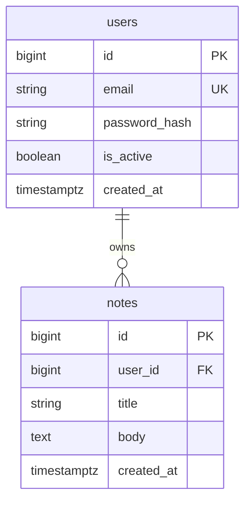

# Database Model — notes-app (modernized)

> Source: tests/fixture-source (notes-app) — modernize-modeler output; every id below resolves to modernization-plan.json.
> Modernized per M-2 (SQLAlchemy 2.x async + Alembic) and M-3 (PostgreSQL 16); the two-table schema shape is kept per K-1.

## System Overview

The modernized data store is PostgreSQL 16: the legacy schema in
`migrations/0001_init.sql:2-18` is re-issued as an Alembic baseline revision. The SQLite file
database at `./notes.db` (source `app.py:8-9`) is removed; `DATABASE_URL` is read from the
environment (M-3). All access goes through an async SQLAlchemy 2.x session over the typed
mapping in `models.py:1-29` (M-2).

## Architecture

- **Engine:** asyncpg against PostgreSQL 16 (M-3). The synchronous `create_engine` call in
  `db.py:1-4` is replaced by an async engine built from `DATABASE_URL`.
- **Migrations:** Alembic owns the schema lifecycle (A-3 resolved). `migrations/0001_init.sql:1`
  becomes revision `0001_baseline`; future changes land as generated revisions instead of
  hand-edited SQL.
- **ORM:** SQLAlchemy 2.x typed mapping; string-based queries are gone (M-2).

## Naming Conventions

Kept from the source model: lowercase snake_case tables and columns — `users`, `notes`,
`user_id`, `password_hash`, `created_at` (`migrations/0001_init.sql:2-8`). PostgreSQL folds
unquoted identifiers to lowercase, so no renaming is required (K-1).

## Entity-Relationship

| node | meaning |
| :-- | :-- |
| users | the account that owns notes (`models.py:7-14`) |
| notes | a note row owned by exactly one user (`models.py:23-29`) |

## Core Entities

- **users** — `email` (unique), `password_hash`, `is_active`, `created_at`
  (`migrations/0001_init.sql:2-8`).
- **notes** — `user_id` FK to users, `title`, `body`, `created_at`
  (`migrations/0001_init.sql:10-16`).

## Relationships

One user owns many notes (1:N). The foreign key `notes.user_id`
(`migrations/0001_init.sql:11`) is kept unchanged (K-1); ownership is still enforced in the
domain layer exactly as in the source model.

## Index Strategy

`idx_notes_user` on `notes(user_id)` (`migrations/0001_init.sql:18`) is re-created inside the
Alembic baseline, and `users(email)` stays unique through its column constraint (M-2).

## Security

Passwords are stored as hashes only; the hash algorithm moves from werkzeug to bcrypt with
re-hash-on-login (M-2). `DATABASE_URL` is environment-driven and must never be committed (M-3).

## Seed Data

The source repository ships no seed data. Alembic's `env.py` gains an optional `--seed` flag so
fixtures can be loaded in CI (M-2); no data rows are added by the migration itself.

## Scalability

PostgreSQL 16 removes the SQLite single-writer limit that a multi-worker uvicorn deployment (M-6)
would hit. Reads scale through the asyncpg connection pool in front of one primary (M-3);
partitioning is not required at this data volume.

## Modernization Decisions (this document)

| id | decision | effect on this document |
| :-- | :-- | :-- |
| M-2 | SQLAlchemy 2.x async + Alembic | typed mapping; versioned migrations |
| M-3 | PostgreSQL 16 + asyncpg | engine and driver swap |
| K-1 | keep entity shape | tables and columns unchanged |

## Resolved Assumptions & Issues

| source marker | id | outcome |
| :-- | :-- | :-- |
| `DatabaseModel.md:13` — schema from a single hand-written SQL file, no migration tooling | A-3 | resolved: Alembic adopted, `0001_init.sql` re-issued as the baseline revision (M-2) |
