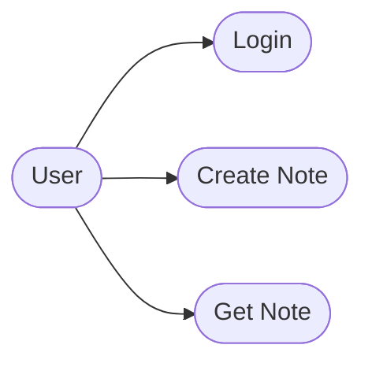

# Use Case Model — notes-app (modernized)

> Source: tests/fixture-source (notes-app) — modernize-modeler output; every id below resolves to modernization-plan.json.
> Modernized per M-1 (FastAPI) and M-4 (typed request/response schemas); login semantics kept per K-2.

## Introduction

Three use cases survive modernization: Login, Create Note, Get Note. The modernized system is
async FastAPI (M-1); the create-note input is validated by Pydantic v2 schemas (M-4), which
defines the previously unknown behavior for malformed bodies (A-4 resolved).

## Actors

| actor | description |
| :-- | :-- |
| User | external end user who authenticates and manages notes (`routes/auth.py:9-15`) |

## Use-Case Diagram

| node | meaning |
| :-- | :-- |
| usr | the end-user actor |
| UC1 | login with email + password (K-2) |
| UC2 | create a note for the authenticated user |
| UC3 | read a note by id |

## Use-Case Specification

### UC1 — Login

**Pre-condition:** the user knows a registered email + password pair.
**Post-condition:** a session token is returned; subsequent calls carry it.
**Main Success Flow:** credentials are POSTed to `/api/login`; the server looks up the user by
email and checks the password hash (`routes/auth.py:9-15`); on success a session token is
returned.
**Alternative Flow:** unknown email or bad password → 401 (semantics kept, K-2).
**Exception:** none beyond 401; the handler is now async (M-1).

### UC2 — Create Note

**Pre-condition:** an authenticated session exists.
**Post-condition:** a Note row exists, owned by the session's user.
**Main Success Flow:** the JSON body is validated against `NoteCreate` (M-4); the server
inserts the note (`routes/notes.py:9-15`, now async under M-1) and returns 201 with `NoteRead`.
**Alternative Flow:** missing or empty title → explicit 400; malformed JSON or missing fields
→ 422 with field errors (M-4). The legacy 500 class for these inputs is gone (I-2 resolved).
**Exception:** validation errors are declarative (Pydantic), not unhandled KeyErrors
(`routes/notes.py:9-15`).

### UC3 — Get Note

**Pre-condition:** an authenticated session exists and the note id is known.
**Post-condition:** the note payload is returned, or 404.
**Main Success Flow:** GET by id (`routes/notes.py:18-21`); the modernized handler returns the
`NoteRead` schema.
**Alternative Flow:** unknown id → 404.
**Exception:** none.

## Exception Summary

| exception | use case | legacy behavior | modernized behavior |
| :-- | :-- | :-- | :-- |
| malformed body | UC2 | unhandled KeyError → 500 (`routes/notes.py:9-15`, I-2) | 422 + field errors (M-4) |
| bad credentials | UC1 | 401 (`routes/auth.py:9-15`) | 401 unchanged (K-2) |
| unknown note | UC3 | 404 | 404 |

## Traceability

| use case | modernized code path | plan refs |
| :-- | :-- | :-- |
| UC1 | `/api/login` (async) | M-1, K-2 |
| UC2 | `POST /api/notes` with `NoteCreate` | M-1, M-4, A-4, I-2 |
| UC3 | `GET /api/notes/{id}` with `NoteRead` | M-1, M-4 |

The source's open marker for UC2's malformed-body behavior is closed by M-4 (A-4): the quote
lives at `UseCaseModel.md:53`.

## Modernization Decisions (this document)

| id | decision | effect on this document |
| :-- | :-- | :-- |
| M-1 | Flask → FastAPI | async handlers; OpenAPI replaces manual docs |
| M-4 | Pydantic v2 schemas | 422/400 replace the 500 on bad input |
| K-2 | keep login semantics | UC1 behavior unchanged |

## Resolved Assumptions & Issues

| source marker | id | outcome |
| :-- | :-- | :-- |
| `UseCaseModel.md:53` — malformed-body behavior was unknown in the source | A-4 | resolved: Pydantic 422 with field errors defines the behavior (M-4) |
| unhandled KeyError → 500 on POST /api/notes | I-2 | resolved: typed request schemas remove the raw dict access (M-4) |
