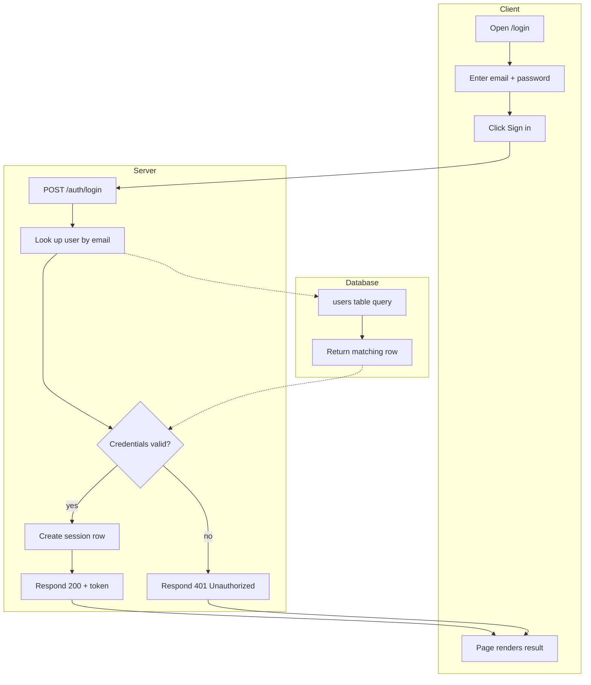
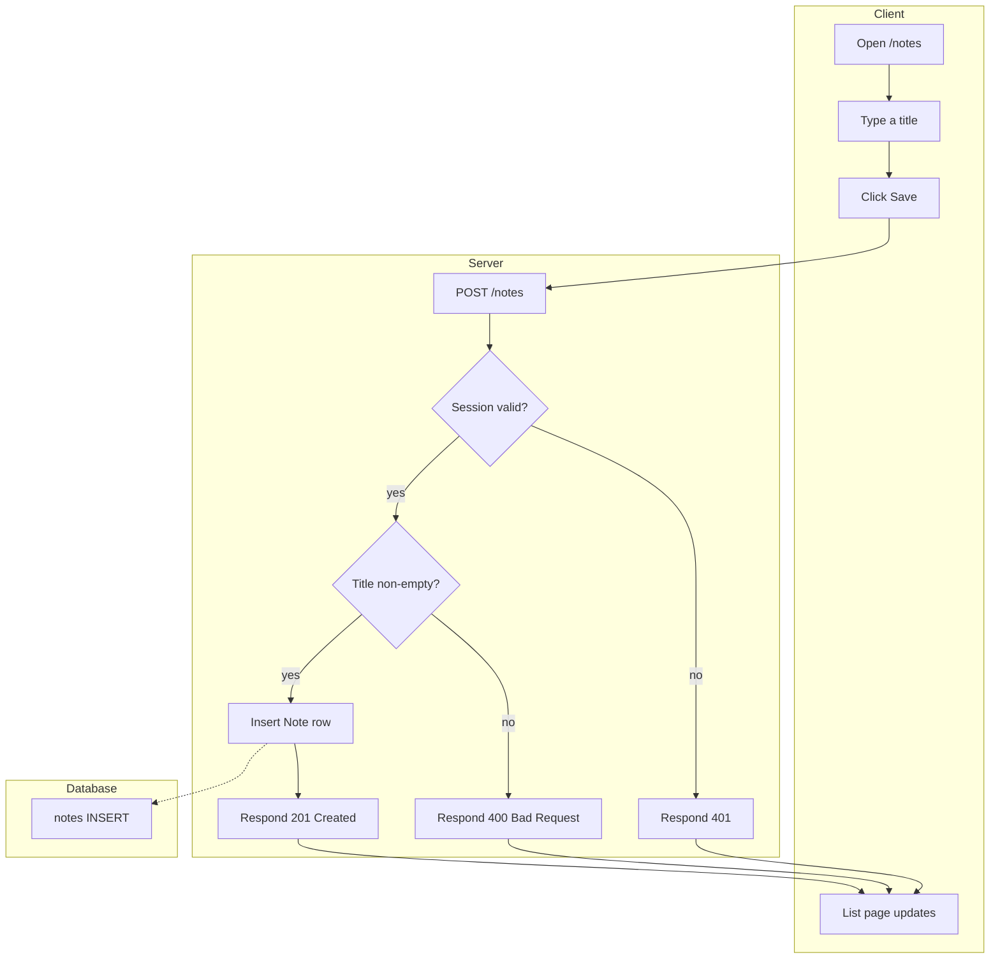

# Activity Diagram — Notes App

Generated by the codebase-modeler skill. Citations point at the pinned repo tree.

## 1. Processes Modelled
Two business processes are modelled, one per API route module:
* **PR-1 — Login** (`routes/auth.py:9-15`)
* **PR-2 — Create note** (`routes/notes.py:9-21`)

## 2. PR-1 — Login

| Node | Meaning | Swimlane |
| :-- | :-- | :-- |
| c1 | Client opens /login | Client |
| c2 | Client enters credentials | Client |
| c3 | Client submits the form | Client |
| c4 | Client page renders the result | Client |
| s1 | Server receives POST /auth/login | Server |
| s2 | Server looks up the user | Server |
| s3 | Decision: credentials valid? | Server |
| s4 | Server creates a session row | Server |
| s5 | Server responds 200 with token | Server |
| s6 | Server responds 401 | Server |
| d1 | Database runs the users query | Database |
| d2 | Database returns the matching row | Database |

## 3. PR-2 — Create note

| Node | Meaning | Swimlane |
| :-- | :-- | :-- |
| n1 | Client opens /notes | Client |
| n2 | Client types a title | Client |
| n3r | Client clicks Save | Client |
| n4 | Client list page updates | Client |
| b1 | Server receives POST /notes | Server |
| b2 | Decision: session valid? | Server |
| b3 | Decision: title non-empty? | Server |
| b4 | Server responds 401 | Server |
| b5 | Server inserts the Note row | Server |
| b6 | Server responds 201 | Server |
| b7 | Server responds 400 | Server |
| e1 | Database runs the notes INSERT | Database |

## 4. Decision Points
* **DP-1 (s3):** password check outcome — happy path continues to session creation, failure ends in 401.
* **DP-2 (b2):** missing/expired session — request is rejected before any validation.
* **DP-3 (b3):** empty title — rejected with 400; the codebase raises no custom
  validation type, only the framework default (see `routes/notes.py:9-21`).

## 5. Swimlane Notes
The Client swimlane is inferred from the absence of frontend sources; the API is
consumed by whatever client the operator deploys. Server steps follow the route
handlers; Database steps follow the single migration (`migrations/0001_init.sql:1-18`).

## 6. Error Handling
* 401 is raised for both bad credentials (PR-1) and missing session (PR-2).
* 400 is raised for an empty title (PR-2); malformed JSON bodies surface as
  framework errors rather than modelled steps.

## 7. Open Items
* Concurrency/async semantics are unmodelled: request handling is synchronous,
  single-process Flask (UNVERIFIED — no async/queue code found in repo).
