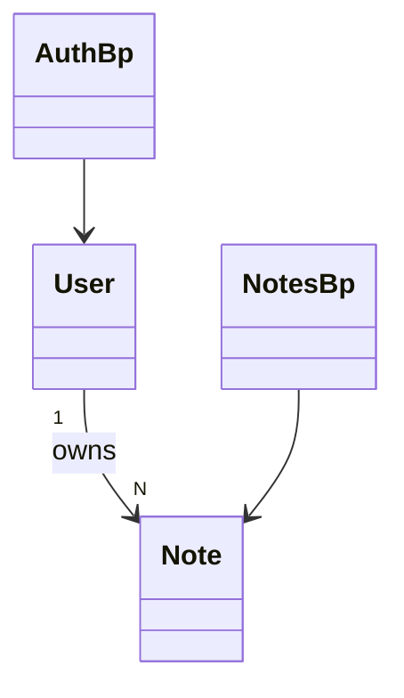

# Class Model — Notes App

Generated by the codebase-modeler skill. Citations point at the pinned repo tree.

## 1. Core Elements of a Class
* **Class Name:** PascalCase noun. * **Attributes:** name, type, visibility.
* **Methods:** parameters + return types. * **Visibility:** `+ - # ~`.

## 2. Backend (Server-Side) Architecture
### A. Domain Models / Entities (ORM Layer)
| Class | Key members | Evidence |
| :-- | :-- | :-- |
| `User` | `id`, `email`, `password_hash`, `set_password()`, `check_password()` | `models.py:7-20` |
| `Note` | `id`, `user_id`, `title`, `body` | `models.py:23-29` |

### B. Data Access Objects / Repositories
Flask-SQLAlchemy `Query` API used inline in routes (no dedicated repositories)
(`routes/notes.py:12`).

### C. Services (Business Logic Layer)
None — logic lives in route handlers (`routes/auth.py:10-15`).

### D. Controllers / Resolvers
| Class | Routes | Evidence |
| :-- | :-- | :-- |
| `auth` Blueprint | `POST /api/login` | `routes/auth.py:6`, `routes/auth.py:9` |
| `notes` Blueprint | `POST /api/notes`, `GET /api/notes/<id>` | `routes/notes.py:6` |

| Node | Element | Code Reference |
| :-- | :-- | :-- |
| User | ORM user entity | `models.py:7-20` |
| Note | ORM note entity | `models.py:23-29` |
| AuthBp | auth blueprint controller | `routes/auth.py:6` |
| NotesBp | notes blueprint controller | `routes/notes.py:6` |

## 3. Cross-Boundary Data (The Network Layer)
### Data Transfer Objects (DTOs)
No explicit DTO classes — raw `request.get_json` dicts and `jsonify` dicts
(`routes/notes.py:11`).

## 4. Frontend (Client-Side) Architecture
No frontend classes — no UI in repo (UNVERIFIED by absence search).

## 5. Relationships and Associations
* `User` 1:N `Note` via `notes.user_id` FK (`models.py:26`).
* Blueprints registered on the app (`app.py:13-14`).
