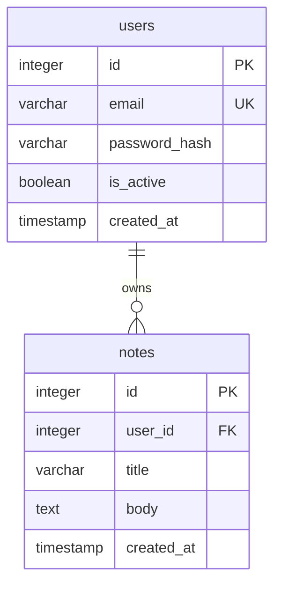

# Database Model — Notes App

Generated by the codebase-modeler skill. Citations point at the pinned repo tree.

## 1. Project & System Overview
* **System Name:** Notes App. * **Description:** persistence for user-owned notes.

## 2. Database Architecture & Technology Stack
* **Database Type:** Relational (SQL).
* **DBMS:** SQLite file database (`app.py:8-9`).
* **ORM / Query Builder:** Flask-SQLAlchemy 3.1.1 (`requirements.txt:2`, `db.py:4`).
* **Migration Tool:** none — a single hand-written SQL script
  (`migrations/0001_init.sql:1`) with no tooling (UNVERIFIED — no Alembic/Flyway config).

## 3. Global Naming Conventions & Standards
* **Tables:** `snake_case` plural (`users`, `notes`).
* **Columns:** `snake_case` (`password_hash`, `created_at`).
* **Primary Keys:** `id` auto-increment (`migrations/0001_init.sql:3`).

## 4. Entity-Relationship Diagram (ERD)

## 5. Core Entities (Data Dictionary)
### 5.1. Entity: `users`
| Column Name | Data Type | Constraints / Modifiers | Description |
| :--- | :--- | :--- | :--- |
| `id` | INTEGER | PRIMARY KEY | user id |
| `email` | VARCHAR(255) | UNIQUE, NOT NULL | login identifier |
| `password_hash` | VARCHAR(255) | NOT NULL | Werkzeug hash |

(`migrations/0001_init.sql:2-8`)

### 5.2. Entity: `notes`
| Column Name | Data Type | Constraints / Modifiers | Description |
| :--- | :--- | :--- | :--- |
| `id` | INTEGER | PRIMARY KEY | note id |
| `user_id` | INTEGER | NOT NULL, FK users(id) | owner |
| `title` | VARCHAR(120) | NOT NULL | note title |
| `body` | TEXT | | note body |

(`migrations/0001_init.sql:10-16`)

## 6. Relationships & Cardinality
* **Users to Notes (1:N):** FK `notes.user_id` -> `users.id`
  (`migrations/0001_init.sql:12`).

## 7. Indexing & Performance Strategy
* One explicit index: `idx_notes_user ON notes (user_id)`
  (`migrations/0001_init.sql:18`).

## 8. Security & Data Compliance
* Passwords stored as Werkzeug hashes, never raw (`models.py:16-20`).

## 9. Seed Data & Environments
* No seed data or environment matrix in repo.

## 10. Future Scalability Considerations
* SQLite file storage limits write concurrency (`app.py:8-9`).
