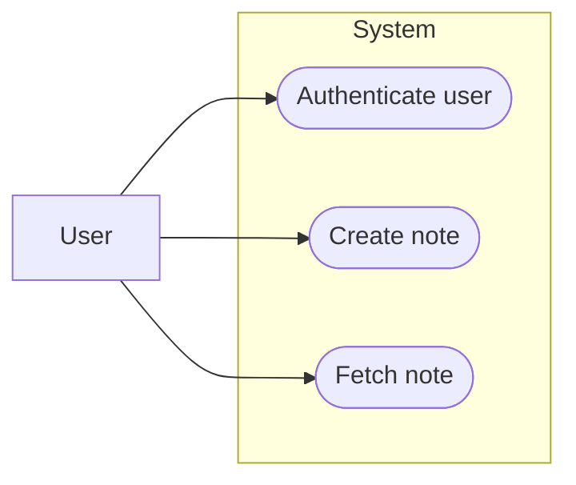

# Use-Case Model — Notes App

Generated by the codebase-modeler skill. Citations point at the pinned repo tree.

## 1. Introduction
### 1.1 Purpose
Capture the functional behavior of the Notes App.
### 1.2 Scope
Login and note create/read; list/delete are out of scope.
### 1.3 Definitions, Acronyms, and Abbreviations
* **FR-n:** functional requirement ids from Specification.md.

## 2. System Boundary & Actors
### 2.1 Primary Actors
* **User:** authenticated via email + password (`routes/auth.py:9-15`).
### 2.2 Secondary / System Actors
None (no external services in `requirements.txt:1-2`).

## 3. Use-Case Diagram

| Node | Element | Code Reference |
| :-- | :-- | :-- |
| User | primary actor | `routes/auth.py:10` |
| UC1 | Authenticate user | `routes/auth.py:9-15` |
| UC2 | Create note | `routes/notes.py:9-15` |
| UC3 | Fetch note | `routes/notes.py:18-21` |

## 4. Use-Case Specifications
### UC-01: Authenticate a User
**1. Brief Description:** exchange email + password for a user identity.
**2. Actors:** Primary: User.
**3. Pre-conditions:** *Backend/DB:* database connection active.
**4. Post-conditions:** *System State:* user located in `users` (`models.py:7-20`).
**5. Main Success Scenario (Happy Path):**
1. **Actor:** submits email + password.
2. **System (Backend):** looks up user, verifies password hash
   (`routes/auth.py:11-13`).
3. **System (Backend):** returns user id + email (`routes/auth.py:15`).
**6. Alternative Flows (Extensions):** none modeled.
**7. Exceptions (Error Flows):** bad credentials -> `401` (`routes/auth.py:14`);
  behavior for a malformed JSON body is UNVERIFIED (no explicit handling seen).
**8. Special Requirements (Non-Functional Requirements):** passwords verified via
  hash comparison only (`models.py:19-20`).

### UC-02: Create a Note
**1. Brief Description:** persist a new note for a user.
**2. Actors:** Primary: User.
**3. Pre-conditions:** *Backend/DB:* payload includes `user_id`, `title`
  (`routes/notes.py:12`).
**4. Post-conditions:** *System State:* note row committed (`routes/notes.py:13-14`).
**5. Main Success Scenario (Happy Path):**
1. **Actor:** POSTs JSON body.
2. **System (Backend):** builds Note, commits, returns `201` + id
   (`routes/notes.py:10-15`).
**6. Alternative Flows (Extensions):** none modeled.
**7. Exceptions (Error Flows):** missing key -> unhandled `KeyError` -> raw `500`
  (`routes/notes.py:12`).
**8. Special Requirements (Non-Functional Requirements):** ownership enforced by FK
  (`models.py:26`).

### UC-03: Fetch a Note
**1. Brief Description:** read one note by id.
**2. Actors:** Primary: User.
**3. Pre-conditions:** *Backend/DB:* note id exists.
**4. Post-conditions:** *Output:* note payload (`routes/notes.py:21`).
**5. Main Success Scenario (Happy Path):**
1. **Actor:** GET `/api/notes/<id>`.
2. **System (Backend):** `get_or_404` and returns the note (`routes/notes.py:19-21`).
**6. Alternative Flows (Extensions):** none modeled.
**7. Exceptions (Error Flows):** unknown id -> `404` (`routes/notes.py:20`).
**8. Special Requirements (Non-Functional Requirements):** no ownership check on read
  (any note id is readable) — noted as a design observation.

## 5. Traceability Matrix
| Use Case ID | Use Case Name | Requirement ID |
| :--- | :--- | :--- |
| UC-01 | Authenticate a User | FR-1, FR-4 |
| UC-02 | Create a Note | FR-2, FR-5 |
| UC-03 | Fetch a Note | FR-3 |

## 6. Appendix
See ActivityDiagram.md for PR-1 / PR-2 flows.
